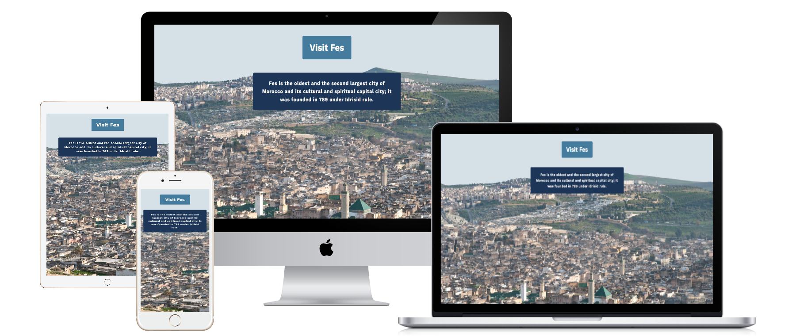

# Hometown Homepage
This is my hometown homepage solo project for [Scrimba](https://scrimba.com/learn/htmlandcss) Learn HTML and CSS course. 
 

## Preview 
 
 

## Live Demo
Check it out on [Github Pages](https://redwanhaitami.github.io/hometown-homepage/) 
 

## About this project 
The project is a landing page consists of four main sections:

- **Section one** is a hero section as introduction, it contains:
  - A background image
  - `h1` heading as a main Title
  - A paragraph as a brief description of my hometown.

- **Section two** is a container of landmarks, it contains:
  - `h2` heading title
  - Three columns each one containing:
    - `h3` heading
    - An image as link
    - A paragraph as a brief description of the landmark 
  
- **Section three** is a container of activities, it contains:
  - `h2` heading title
  - Three columns each one containing:
    - Icon
    - `h3` heading
    - paragraph as a brief description of the activity
  
- **Section four** for the guide card which contains:
    - My personal image
    - `h4` heading 
    - Paragraph to introduce me as a guide 
   
  
## Requirements 

- Make it about your own hometown or country
- use classes
- Use flexbox
- Use background image
- Use color palette
- Add a whole new section 
 

## My process 

The project built with: 

- Semantic HTML5 markup
- CSS custom properties
- Flexbox for aligning elements
- Hover pseudo class on landmarks
- [Font awesome](https://fontawesome.com/) icons in activities section
- Colors used: [Color Palette](https://coolors.co/ffffff-f1fafe-a8dadc-457b9d-1d3557)
- Media Queries for both desktop and mobile devices 
 

## What was learned

The course in general was very interesting to me through: 

- Building four awesome projects more than the solo project.
- Solving interactive coding challenges.
- Learning to use new skills in my solo project like [Figma](https://www.figma.com/file/2QuGfAOcHaZJ6aHXfuamnK/Hometown-Homepage?type=design&node-id=0-1&mode=design) tool. 
   
  
## Attributions

- Images by [Wikimedia Commons](https://commons.wikimedia.org/wiki/Main_Page)
- Favicon by [Flaticon](https://www.flaticon.com/)
